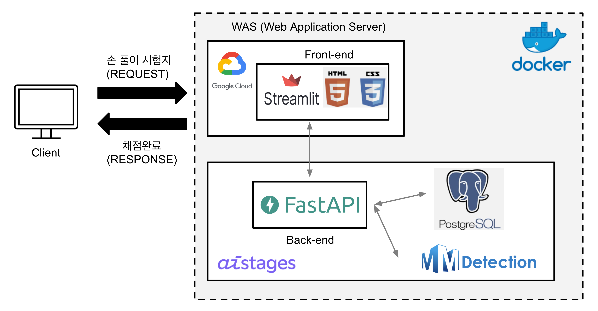

# BoostCamp AI Tech4 Final-Project-CV-14 몇점일까?

##   Member🔥

| [김지훈](https://github.com/kzh3010) | [원준식](https://github.com/JSJSWON) | [송영섭](https://github.com/gih0109) | [허건혁](https://github.com/GeonHyeock) | [홍주영](https://github.com/archemist-hong) |
| :-: | :-: | :-: | :-: | :-: |
|  |  |  |  |  |

##  💯 프로젝트 소개

### - Purpose
채점은 단순 반복 업무이면서, 시간이 오래 걸리는 피곤하고 귀찮은 일입니다. 게다가 채점을 하다 보면 눈, 허리 등의 피로도에 따라 실수가 발생할 수 있는 업무이기도 합니다. 

이러한 단순 반복 업무를 딥러닝을 이용하여 사람의 노동력을 줄이고 정확도와 속도 측면에서 능률을 올리기 위해 서비스를 제작하였습니다.

### - Expectations
사전 조사를 통해 최근 학생들이 스마트 디바이스를 통해 시험지를 푸는 경우가 많다는 것을 알게 되었습니다. 

이 서비스는 스마트 디바이스에서 학생이 손으로 풀이한 시험지를 추가적인 노동력 없이 빠르고 정확하게 채점할 수는 AI 학습 보조 도구로서의 역할을 하도록 하고자 합니다.

##  📑 Project Overview

- 프로젝트 수행 기간 : 2023.01.09. ~ 2023.02.09.
- 발표 영상: [Link](https://youtu.be/K58zIGAeKP8)
- 발표 자료: [Link](https://drive.google.com/file/d/19-3Co7l_IogkPFJwmyt27zMFkGrljhQs/view?usp=sharing)
- 프로젝트 소개 : [Link](https://whatsthescore.notion.site/751cae9de62c4603b6bc26fbb71eb156)

##  🎥 데모 영상

##  🗄️ Data set
 
- Annotation
    - Hasty annotation tool
    - 평가원 수능 수학 모의고사 11개년 768장
- Synthetic Data 
    - 원본 데이터 + [CROHME](https://www.isical.ac.in/~crohme/) 손 필기 수식 데이터 + 직접 제작한 체크 표시 이미지 데이터
- 데이터 관리
    - DVC(Data Version Control)
    - 구글 드라이브 API 

##  🧤 Flow Chart

- input 
    - 학생들이 풀이한 시험지 pdf 파일
- Detection 
    - 객관식 보기 및 주관식 정답 Detection
- Text recognition
    - Detection 된 주관식 정답을 recognition
- 채점
    - DB에 저장된 정답과 비교 후 채점

##  🚩 Demo Page Structure

- Frontend - Streamlit(Html,CSS)
- Backend - FastAPI 
- DataBase - PostgreSQL
- Docker
- Google Cloud Platform

##   Model Development

###   Synthetic Dataset 

### 1. Dataset 구축 시나리오

1. 데이터 탐색
- 수학 문제가 담긴 이미지 데이터

2. 저작권에서 자유로운 데이터
- 수능/모의고사 시험지 -> 평가원에서 상업적 이용 외 사용가능하다는 답변 확인
  
3. 수집하지 않은 데이터
- 개인이 풀이한 뒤 웹에 공개한 데이터

### 2. Dataset Annotation for Detection

Detection BBox Annotation 가이드 : [Link](https://docs.google.com/presentation/d/1egpoPjG9h6XrKhjdMvsR7MbLgqGZ6pwSD3su1dMKsMc/edit#slide=id.g1d1aa1a43d9_2_75)
- 팀원 모두 일관되게 annotation 가능하게 가이드하는것을 목표
- annotation 규칙이 애매할 경우 판단 기준

### 3. Synthetic Dataset 개발
- 목표
  - 실제 사용자가 푼 것처럼 필기가 되어있고 객관식 답 체크 및 주관식 답 작성이 되어있는 합성 이미지 제작

- 제작에 사용한 요소
  - CROHME 필기 이미지
  

   - 체크 표시 이미지
  

  - 주관식 답 이미지 (MNIST이용)
  

- 학습에 사용된 합성 데이터 이미지

### 4. Synthetic Dataset 개발과정

#### Synthetic Dataset v1
- 최초 데이터셋

mAP: 0.4780
|체크 탐지|a0(체크X)|a1|a2|a3|a4|a5|
|------|---|---|---|---|---|---|
|mAP|0.431|0.415|0.442|0.587|0.500|0.495|

#### Synthetic Dataset v2
- 필기 겹침 제거, 보기 겹침 제거
- 랜덤생성 코드 추가

mAP: 0.576
|체크 탐지|a0(체크X)|a1|a2|a3|a4|a5|
|------|---|---|---|---|---|---|
|mAP|0.591|0.600|0.538|0.613|0.597|0.519|

#### Synthetic Dataset v3
- 체크표시와 다른 필기를 가진 데이터를 추가
- 클래스 불균형 제거

mAP: 0.515
|체크 탐지|a0(체크X)|a1|a2|a3|a4|a5|
|------|---|---|---|---|---|---|
|mAP|0.482|0.513|0.573|0.547|0.474|0.502|

#### Synthetic Dataset v4
- 필기가 합성되지 않은 데이터 추가
- 필기 합성 밀도 랜덤 추가

mAP: 0.831
|체크 탐지|a0(체크X)|a1|a2|a3|a4|a5|
|------|---|---|---|---|---|---|
|mAP|0.786|0.797|0.890|0.862|0.829|0.823|

#### Synthetic Dataset v5
- 데이터 에러 수정
- 주관식 단답형 합성 추가

mAP: 0.8700
|체크 탐지|a0(체크X)|a1|a2|a3|a4|a5|주관식|
|------|---|---|---|---|---|---|---|
|mAP|0.828|0.903|0.859|0.861|0.878|0.818|0.940|

### Augmentation

- Augmentation 탐색 및 데이터에 적합한 Augmentation 개발

#### 1. Auto Augment
- Multi-scale Resize 와 RandomCrop 을 자동으로 적용

(대조군) mAP: 0.606
|체크 탐지|a0(체크X)|a1|a2|a3|a4|a5|
|------|---|---|---|---|---|---|
|mAP| | | | | | |

(실험군) mAP: 0.7970
|체크 탐지|a0(체크X)|a1|a2|a3|a4|a5|
|------|---|---|---|---|---|---|
|mAP|0.828|0.781|0.807|0.839|0.777|0.748|

#### 2. Vertical Half Cut-Mix

- 이미지를 세로 절반으로 잘라 특정 확률에 따라 이미지를 섞는 Augmentation

(대조군) mAP: 0.8310
|체크 탐지|a0(체크X)|a1|a2|a3|a4|a5|
|------|---|---|---|---|---|---|
|mAP|0.786|0.797|0.890|0.862|0.829|0.823|

(실험군) mAP: 0.9090
|체크 탐지|a0(체크X)|a1|a2|a3|a4|a5|
|------|---|---|---|---|---|---|
|mAP|0.867|0.914|0.909|0.917|0.924|0.913|

### 최종 모델 채점 성능

|시험지 종류|객관식 정확도|정확도율(%)|
|---|---|---|
|2023_수능|21/21|100%|
|2023_9월|19/21||90.4%|
|2023_6월|21/21|100%|
|2022_수능|21/21|100%|
|2022_9월|19/21|90.4%|
|2022_6월|21/21|100%|
|2021_수능_나|20/21|95.2%|
|2021_수능_가|21/21|100%|
|2021_9월_나|17/21|80.9%|
|2021_9월_가|18/21|85.7%|
| 계|198/210|94.3%|

##  🔎 Future Research

- inference time 단축
- Mobile Application 제작
- jpg 등과 같은 이미지 파일 적용
- 기능 개발(시험 과목 확장, 유사문제 추천, 해설 제공 등)

##  📜 Reference

- [Mmdetection](https://github.com/open-mmlab/mmdetection)
- [Cascade R-CNN](https://arxiv.org/abs/1712.00726)
- [ConvNeXt](https://github.com/facebookresearch/ConvNeXt)
- [Clovaai : TPS-ResNet-BiLSTM-Attn](https://github.com/clovaai/deep-text-recognition-benchmark)
- [모수_모두의 수학](https://blog.naver.com/math4x/222574149191)
- [한국교육과정평가원](https://www.suneung.re.kr/boardCnts/list.do?boardID=1500234&m=0403&s=suneung&searchStr=)
