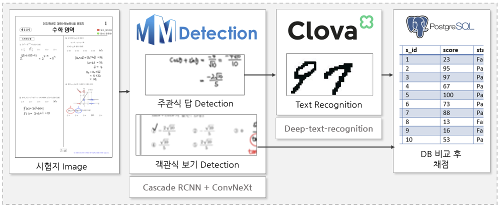
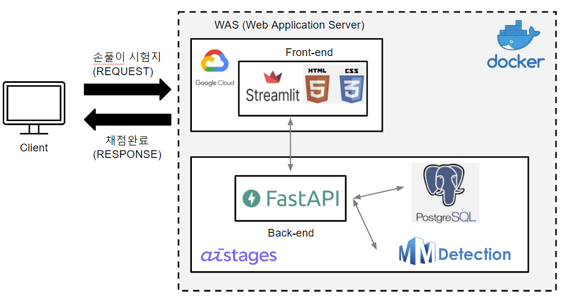

# BoostCamp AI Tech4 Final-Project-CV-14 몇점일까? 
## Member🔥
| [김지훈](https://github.com/kzh3010) | [원준식](https://github.com/JSJSWON) | [송영섭](https://github.com/gih0109) | [허건혁](https://github.com/GeonHyeock) | [홍주영](https://github.com/archemist-hong) |
| :-: | :-: | :-: | :-: | :-: |
|  |  |  |  |  |
***

##  💯 프로젝트 소개
***
### - Purpose
채점은 단순 반복 업무이면서, 시간이 오래 걸리는 피곤하고 귀찮은 일입니다. 게다가 채점을 하다 보면 눈, 허리 등의 피로도에 따라 실수가 발생할 수 있는 업무이기도 합니다. 

이러한 단순 반복 업무를 딥러닝을 이용하여 사람의 노동력을 줄이고 정확도와 속도 측면에서 능률을 올리기 위해 서비스를 제작하였습니다. 

### - Expectations
사전 조사를 통해 최근 학생들이 스마트 디바이스를 통해 시험지를 푸는 경우가 많다는 것을 알게 되었습니다. 

이 서비스는 스마트 디바이스에서 학생이 손으로 풀이한 시험지를 추가적인 노동력 없이 빠르고 정확하게 채점할 수는 AI 학습 보조 도구로서의 역할을 하도록 하고자 합니다

##  📑 Project Overview
***
- 프로젝트 수행 기간 : 2023.01.09 ~ 2023.02.09
- 발표 영상: Link
- 발표 자료: Link
- 프로젝트 소개 : Link

##  🎥 데모 영상
***

##  🗄️ Data set
*** 
- Annotation
    - Hasty annotation tool
    - 평가원 수능 수학 모의고사 11개년 768장
- Synthetic Data 
    - CROHME 손 필기 수식 데이터 + 체크 표시 이미지 데이터 제작
- DVC(Data Version Control)
    - 데이터 버전 관리
    - 구글 드라이브 API 

##  🧤 Flow Chart
***

- input 
    - 학생들이 풀이한 시험지 pdf파일
- Detection 
    - 객관식 보기 Detection
    - 주관식 정담 Detection
- Text_recognition
    - Detection 된 주관식 정답을 recognition
- DB(PostgreSQL)
    - DB에 저장 된 정답과 비교 후 채점 진행
##  🚩 Demo Page Structure
***

- Frontend - Streamlit(Html,CSS)
- Backend - FastAPI 
- DataBase - PostgreSQL
- Docker
- Google Cloud Platform

##  🔎 Future Research
***
- inference time 단축
- Mobile Application 제작
- jpg 등과 같은 이미지 파일 적용
- 기능 개발(시험 과목 확장, 유사문제 추천, 해설 제공 등)

##  📜 Reference
***
- [Mmdetection](https://github.com/open-mmlab/mmdetection)
- [Cascade R-CNN](https://arxiv.org/abs/1712.00726)
- [ConvNeXt](https://github.com/facebookresearch/ConvNeXt)
- [Clovaai : TPS-ResNet-BiLSTM-Attn](https://github.com/clovaai/deep-text-recognition-benchmark)
- [모수_모두의 수학](https://blog.naver.com/math4x/222574149191)
- [한국교육과정평가원](https://www.suneung.re.kr/boardCnts/list.do?boardID=1500234&m=0403&s=suneung&searchStr=)
